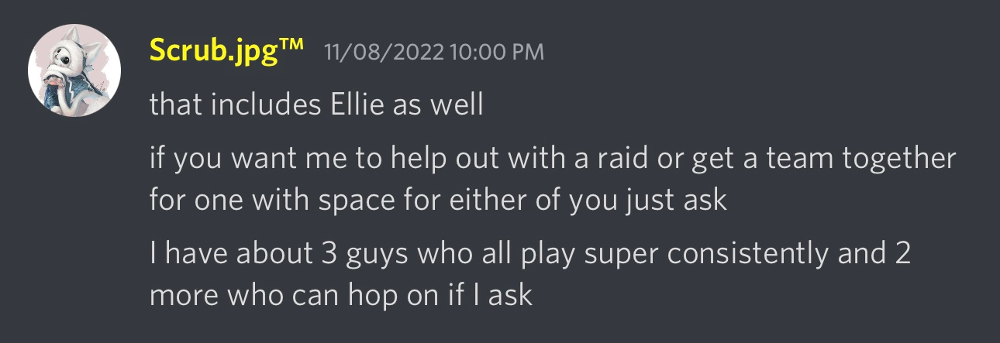

# Friends

Destiny is fun. I got it back in early 2016, a few months after the Taken King released, and enjoyed every bit of it. I've been invested in the Destiny universe ever since, it's one of my favorite game series now...but it's a lot more fun with friends. Bungie is right on that.

On my PlayStation 3 with the first Destiny, I didn't have anyone to play with. I couldn't do any of the raids I wanted and had to work with random people to hope that they weren't speedrunning a strike and leaving me behind to die over and over. And Crucible, well it was fun but hardly a friendly experience. Still, I went on, buying the Taken King and continuing my Light-filled journey.

I began like this with Destiny 2 as well - getting my PlayStation 4 and New Light access to the base game and the first two expansions. Throughout the story, I was fine being alone. But then, it ended. I had no DLCs that I could afford, and again... no one to play with. So I actually ended up quitting the game and removing it for a while, turning back to PlayStation 3 development and Assassin's Creed instead.

I purchased Forsaken, Shadowkeep, and Beyond Light, and that renewed my passion for the Destiny universe. Then the cycle ended again, and I had another hiatus. Once I bought the Witch Queen, I knew I was probably just going to abandon it again.

Until, I didn't.

I repurchased all of the content on my MacBook Pro, as well as preordering Lightfall. And by moving to my MacBook, I made it easier to connect with people online. Which inevitably lead to someone in my girlfriend's Discord server-

At this point, I already had two friends in my own Discord that were on and off about working together, usually due to time or them doing other things in the game at the time. I'd started using the Looking For Group function to get together with people, and that wasn't going particularly well since I was a newbie.

But now, Scrub had noticed I was playing the game a lot. And offered to give me help too?!

So we set up a time to do a King's Fall raid - and it went amazing. Because we weren't just doing the raid... we were actually starting to become friends at that point. They used each other's real names, made jokes, and were super chill. When I told them I was transgender, they accepted it and immediately began to use the right pronouns and name! Since then, we've completed Vault of Glass, and started Vow god knows how many times (we haven't cleared it as a team just yet.)

But, anyway, it's nice. I have people to talk to when I game, I can plan out encounters and dungeons and raids and matches with _friends_ now. You'll get to meet this group on Friday, as we are planning to do a few raids back-to-back, with me streaming it on my YouTube channel! I'm very excited for it - I've been waiting for a friend group to game with for a while.

Thanks Scrub!
