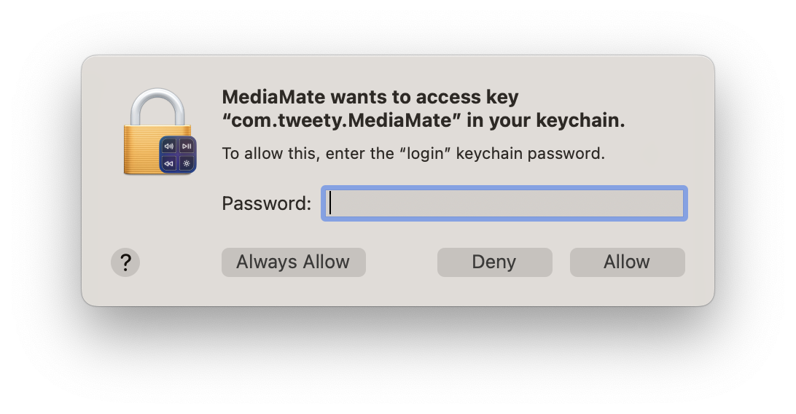
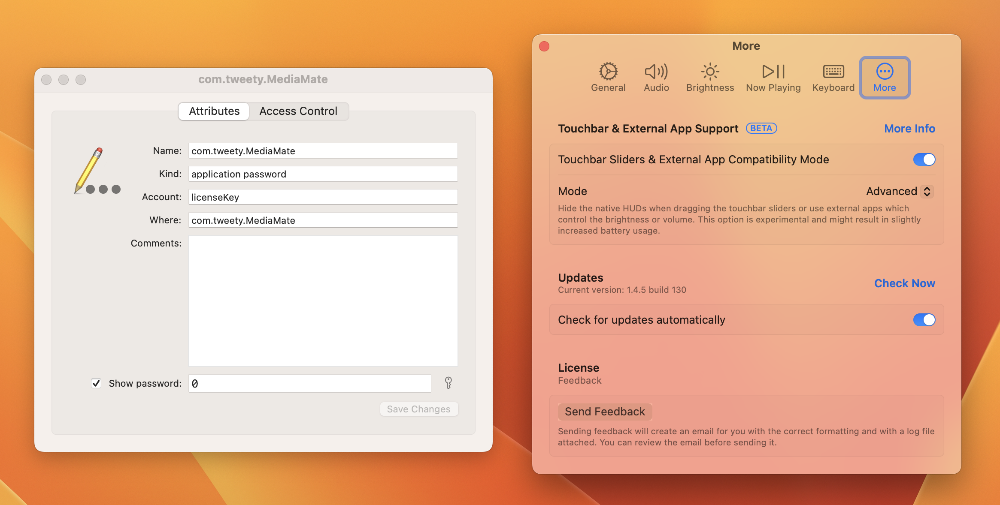

# Software developers and license keys

**Update on June 1st:** The developer ended up patching this and then writing me an email in response to add a few notes. Since he also told me to remove the copyright protected emails I posted here I don't think I can really say what he said here in the email he wrote to me so... L I guess.

This is somewhat of a PSA on why you _shouldn't_ do what this developer did.

So I downloaded this new app called MediaMate on my Mac. It's designed to replace the on-screen displays (volume, brightness, keyboard backlight) with more modern versions inspired by iOS. It even includes a custom Now Playing OSD for when you play some new content.

It's usually 5 euros to get on the developer's website. Notice how I said usually.

Yeah because I was able to crack this app open in like ten seconds. Let me explain why.

I asked a friend with a copy of this app to share their key - since they have four devices left to activate with it. With the key, they shared some emails between them and the developer because they had to have the key reset in the past (which will be explained by this excerpt that caught my eye):

> \[Redacted\]

Did you catch that? The license key is stored in the _keychain_. This by itself isn't the issue, I know there are some other apps that do the same, and the explanation for this choice from this developer is as follows:

> \[Redacted\]

Okay, so that's a reasonable choice. But the actual execution of it is terribly wrong.

Using these two bits of information and an already-activated copy of MediaMate, I tested something. What would happen if I copied the license to another Mac without removing the license from the original?

Well...

See, this seems normal. 2/5 devices were activated with the key, and there are two devices. Except remember - this is a key from my friend. He's already activated a device using this same key.

This led me to learn how the app functions with the licensing:

- If the keychain item does not exist
    - It will prompt you to enter one
    
    - When entering, it contacts the server to make sure it's a real key
    
    - When verified, it tells the server that a new "device" has been activated with that key, filling a slot
        - 1/5, 2/5, 3/5, etc.
    
    - It will then ask the server to provide information on the key to show in the More menu
        - The device slot count, key itself, and a Remove License button

- If the keychain item does exist
    - It will send the key to the server to provide information on the key to show in the More menu

There's a serious flaw there. If the keychain item already exists, it doesn't contact the server for filling a device slot. But where did I get the verification skip from?

I tested this too. I changed from the actual value of a real key - the one my friend sent - to a random one. I set "0" as my test.

As with any manually created/edited keychain item, macOS did prompt to allow MediaMate to use the value stored in the keychain.

Entering my password, I continued quickly to find this:

The entire License section just broke. You can see that it even shrank the heading of Feedback because the text view, Remove Device, and license key information just disappeared from the application.

However, the app _still_ reported that it was activated. Even with an obviously garbage value as the key, it still functioned with no time limits (the trial mode shoves the preferences window into your face every 30 seconds.)

This means that if the keychain item exists, then the app completely ignores what it is an assumes that it's an actual key. I tried a bunch of different things (some vulgar because that's funny) and they all returned the same result.

I made sure it wasn't just because I had activated in the past by sharing the steps with some friends and they all were able to activate using bogus values.

The thing is that this app does contact the server to get information on the key - that's the reason the License section breaks (because the server returns nil, the sections are also set to nil.) However, verification of the key and filling device slots only happen when you use the app's text box... which doesn't appear when the keychain item already exists.

That's not good for an app that stores the _unhashed_ license key in the login keychain.

If I see any of you developers out there doing something like this, I will shame you for it. This may be funny but is also... kinda stupid.
