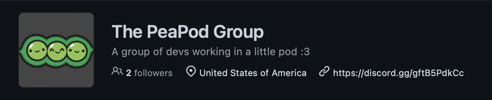

# A new development group: PeaPodDevs!

So a bunch of stuff happened, a TL;DR is that I've been getting closer with the QCXR (QuestCraft) staff team over these past few weeks. The two lead developers are super comfortable with me, and vice versa.

After a bunch of talking and thinking about random projects, we all started a new group called the PeaPodDevs.

Now we have an official space to tackle the random projects that we want to! And currently, we're working on a few big things - including MetalXR, taking OpenComposite and OpenXR to the Mac with Metal support!

I'm not sure how many projects we'll start, but this is still a nice little group to collaborate and share with... and it convinced CADIndie and The Judge to come work on macOS stuff with me.

Short post, but there's also another on its way and not much to say here (or I just forgot,) so instead just click on the link below and follow us because yes.

[https://github.com/PeaPodDevs](https://github.com/PeaPodDevs)
