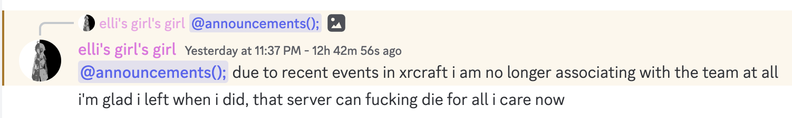
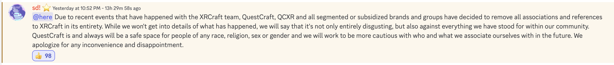

# Downfall, part 3

And now we have the aftermath. What came after this all happened.

## Me

I immediately banned Gus, Shradinx, and Necromancer from my personal Discord server, and posted an announcement that I condemned their actions and would no longer be associated with them.

I was very pissed off, if you couldn't tell, **and I'll be discussing my personal reaction to each member in part 4 of these posts.**

## XRCraft

Oh, XRCraft is dead. Yeah, it's not coming back. Ever. Both QCXR and the remaining staff team of XRCraft said it's not coming back, and there's no way BisectHosting will allow it to continue anymore.

## QCXR

QCXR is actually handling itself pretty well, given that ropes were being cut off a while ago already. This just put the last nail in the coffin and solidified how QCXR was no longer supporting the XRCraft team, and they were able to reaffirm that QuestCraft is designed around inclusivity and friendship.

## BisectHosting

Nothing from them on the matter yet, however CADIndie will be talking to them soon. It is likely that XRCraft will be completely obliterated, and possibly even the partnership between QCXR as well.

## Social Media Manager

This is fucked. Rosslight1 was the social media manager and an important stepping stone in planning the XRCraft event. He was in talks with Intel about XRCraft event planning, and is known by some very talented individuals. His ass is on the line now because of their actions, and he could lose a lot of what he's been working towards in his career.

Intel and other companies, if you happen to be looking at this, be aware that it wasn't Ross's fault for any of this. He's a great person to be around and works hard, and had nothing to do with this.

## Oblivious Network

Well at least they are getting more members now. I mean what else can I say, their business is going to be booming now that XRCraft is dead.

## The XRCraft staff

I'm not sure they'll be able to live this one down. A lot of good people might get burned for this, and that's what I'm expecting if this issue is misreported. Hence why I'm writing these posts, actually. Other than to vent.

[Next one](https://crystall1ne.dev/2023/05/15/downfall-pt-4/)
