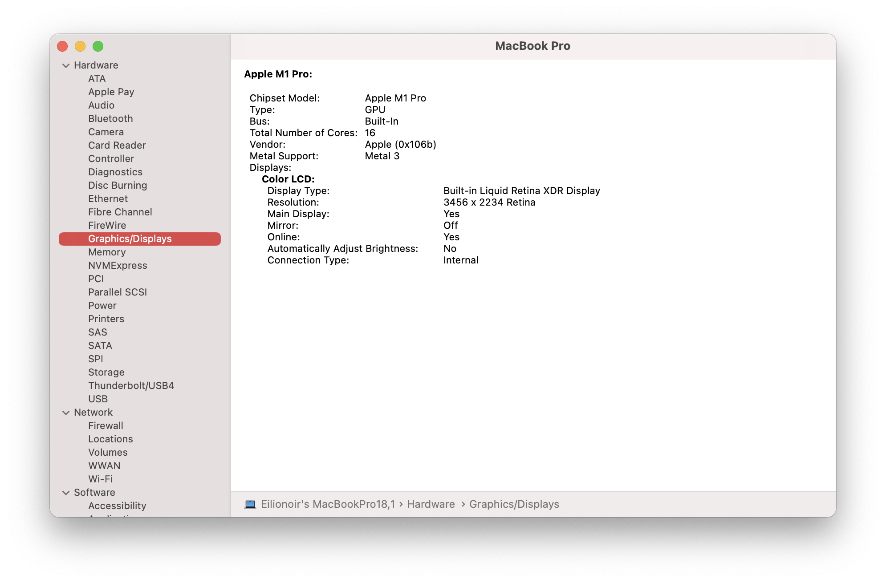

# It is Metal 1, 2, or 3?

This post is coming for good reasons, and not only related to MetalXR's README at the moment, but also because information on this is very inconsistent and has really only been said point blank in OCLP's Discord (the information is scattered across issues on the repo and can be hard to navigate.)

So, just to make it clear. These are the Mac GPUs that support each version of Apple's Metal API.

**Metal 1** - Introduced in OS X 10.11, it supports:

- Intel Ivy Bridge (HD 4xxx) and later

- AMD GCN (HD 7xxx) and later

- NVIDIA Kepler (GTX 6xx/7xx)
    - Be careful, [some cards here have non-Kepler variants.](https://dortania.github.io/GPU-Buyers-Guide/modern-gpus/nvidia-gpu.html#kepler-series-gtx-6xx-7xx)

- NVIDIA Maxwell and Pascal (GTX 9xx-10xx)
    - Both require the NVIDIA Web Drivers
        - Not supported with Metal in macOS 10.14 or later
    
    - Pascal (GTX10xx) support added in macOS 10.12.4.

**Metal 2** - Introduced in macOS 10.13, it supports:

- Intel Skylake (HD/Iris/Iris Pro 5xx) and later

- AMD GCN (HD 7xxx) and later

- Apple G13 (M1) and later

While High Sierra did add new optimizations and changes to Metal 1 GPUs, those cards don't support the full feature set of Metal 2. This is reflected by the new changes to add different macOS GPU families. In macOS 10.13 to macOS 12, you can see them directly:

- macOS GPUFamily1 - Metal 1

- macOS GPUFamily2 - Metal 2

**Metal 3** - Introduced in macOS 13, it supports:

- Intel UHD Graphics 630

- Intel Kaby Lake (Iris Plus cards only) and later

- AMD GCN 5 (Vega) and later

- Apple G13 (M1) and later

macOS Ventura again adds some new capabilities to Metal 2 cards - however **it does not support Metal 1-only cards either.** This means that System Information is bugged with Metal 1 GPUs in Ventura, and they all report as Metal 2 or Metal 3. This is purely cosmetic - running apps that depend on unsupported features will still crash.
