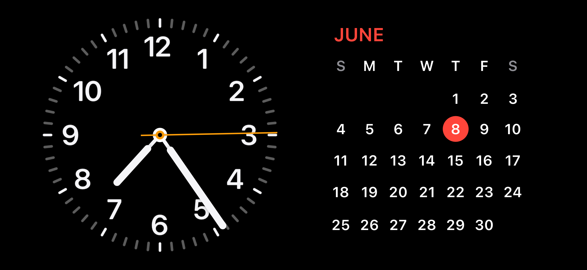
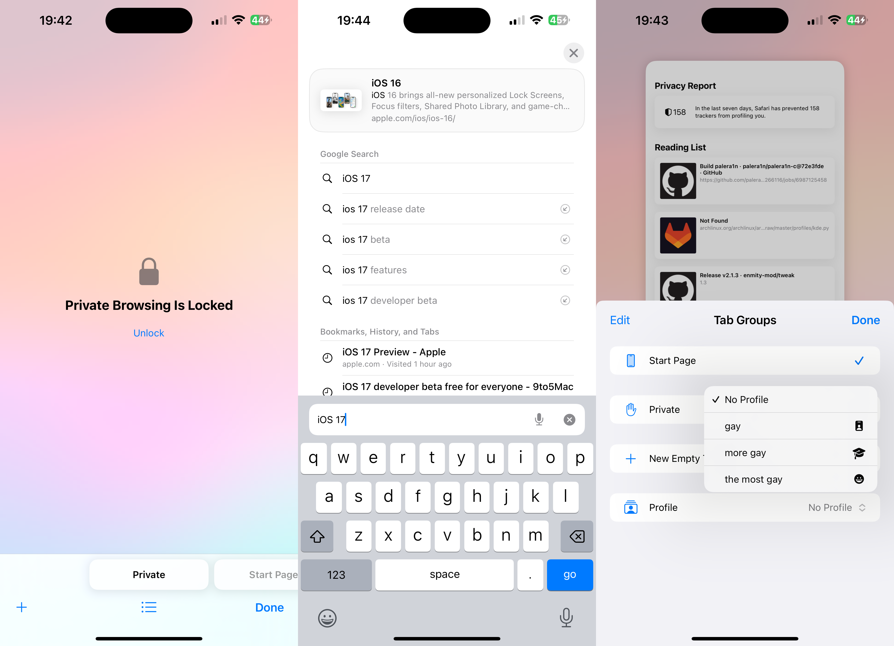
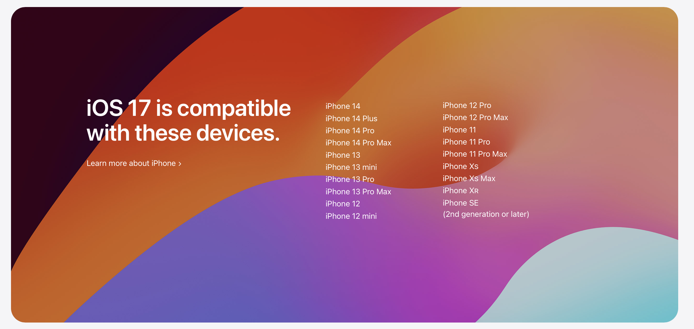

# WWDC23 - iOS 17

I spent some time playing around and learning about some of the stuff Apple announced during their annual Worldwide Developer Conference this year. In these posts, I'm gonna be covering my reaction to various software stuffs. Hardware might come later, when I feel like doing it.

Anyway, let's get into it, starting with **iOS 17**.

On the surface, these are pretty small updates. Well, under the hood too - these are also not as major as some earlier releases - like iOS 13 or 14. Still, it has some new features I'm interested in, and some I quite like.

My current devices are an iPhone 14 Pro Max for iOS 17, and an iPad Pro (11-inch, 2018) for iPadOS 17. The experience is similar but subtly different, but I'll get to that later.

### Lock Screen

Building off of the Lock Screen customization options that Apple introduced in iOS 16, Apple's added some more widgets and more control - including a font weight adjuster for the clock. The iOS 17 wallpaper is very pretty, as well as the Kaleidoscope wallpapers now included. There's really not much to say about the lock screen beyond this, though - it's basically exactly the same as last year.

Although, iOS 17 does change one thing about the lock screen: StandBy. This new feature is like an evolved version of the Apple Watch's Nightstand mode, and works on any device that runs iOS 17. Always-On Display mode requires a device with the advanced display controller though, meaning only the iPhone 14 Pro and Pro Max (as of this writing, at least). Honestly, it's really nice to have a big screen like this presenting information at a glance. AOD was pretty cool - this is another level.

## Home Screen and General UX

While the Home Screen itself didn't change much, there are a few notable things, starting with Interactive Widgets! I'm pretty sure this was one of the most requested features ever since widgets landed on the iOS home screen, and it's interesting to think that it's taken Apple until just now to implement them. Each of the widgets on this home screen page can be tapped to do something instead of just opening the app that contains the widget - like playing a song, launching a game, or setting a reminder to completed.

We also see two other areas that got some major changes - Spotlight and the keyboard. For the keyboard, we were expecting a new experience with Apple's new transformer-based autocorrection and predictive text. I can happily say that I have had both enabled for the past few days of running iOS 17, and I haven't yet thrown my iPhone at a wall - this time around, it's actually learning from what I'm typing! The text caret also changes color based on the app you are using, and has a subtle difference in its animation.

You may have also noticed a change to Spotlight in the above pictures - each result is now bigger, making them easier to tap, and they show richer content in some cases as well. I've also found that typing sentences in question-like formats gives you results to it - maybe this was just a thing I didn't notice in iOS 16, though. What wasn't in 16, however, is the satisfying new fade-and-zoom-in transition when opening apps from Spotlight, replacing the jarring slide-in of the past. Nice one, Apple!

## Safari

Safari's updates aren't too big, but still note-worthy.

Private Browsing mode is more private now that you can set a lock on those tabs, although if I'm being honest that's probably going to be used by people to lock their porn stashes nowadays. That's just how Porn mode - I mean Private Browsing - be nowadays. The addition of separate Safari profiles is also genuinely useful in my opinion, being able to separate my different sections of life from each other and not being on the wrong accounts when I do things! Like come on, I can't be the only one who's created a Google Doc on the wrong account.

Safari's improved search is kinda... mehhh. It's definitely snappier but I find the results to still be somewhat below what Apple had said they were going to be. Then again, it's beta 1 - take my review on that with a grain of salt, Apple will likely be improving it. You can also see that Safari takes on the new layout that Spotlight has adopted too in the image above.

## Communication and Sharing

One of the big headlining features of iOS 17 was the new Contact Poster feature. And I tried it out...

...uh, right now it's completely broken.

Yeah, I tried setting it up with Stella and it just displayed a background with the main color of my profile picture. We tried both ends and it just stuck like that. Beta bugs,I guess - it does look pretty nice in the editor, just wish it worked outside of that.

The new layout for Phone, Contacts, Messages, and the in-call screen are working though, and they look pretty! Refined, tweaked, whatever you want to call it. There's more of an emphasis on being personal with your Contacts, including larger profile pictures, moving the call buttons to the bottom of the screen, and being able to see the live location of your Find My Friends in Messages too.

Although I will say that Apple should change some of the icons for the new iMessage app popup - some of them don't seem as iOS as they should be.

Apple modified AirDrop as well - not just with NearDrop, though. It seems to be at least a little bit faster at sending to your other devices, although it's buggy with devices that don't have Apple IDs currently signed in. I've also been having this issue where I get a notification about AirDrop sending something after it's completed. Beta bugs.

## Other stuff

There's not really much else that I have noticed from iOS 17, or I'm just not looking hard enough, to be honest. I'll probably revise this later so come back for updates in the future - I'll mark it if I do make an addition.

I would like to comment on the device support though, because this is the first release of iOS to be arm64e-only. When I learned that the iPhone 8, 8 Plus, and X were officially dropped from support, I wasn't surprised but I was still a little bit on the sad side. It feels like yesterday that the X was introduced to the world and we all craved the advanced technologies inside of it, as well as made fun of the notch.

It's kind of the end of an era, with the first notched iPhone being dropped from support. Weird feeling going on, I guess.
