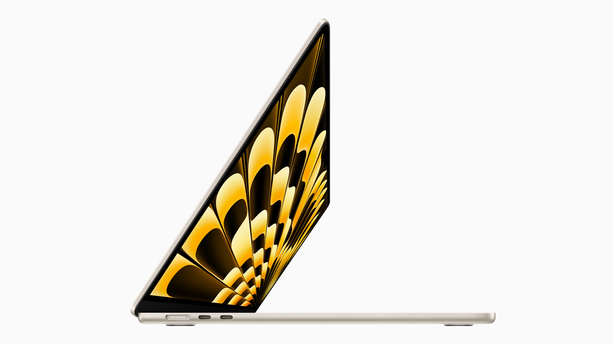
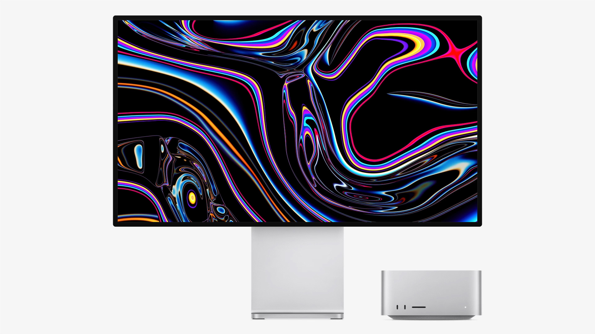
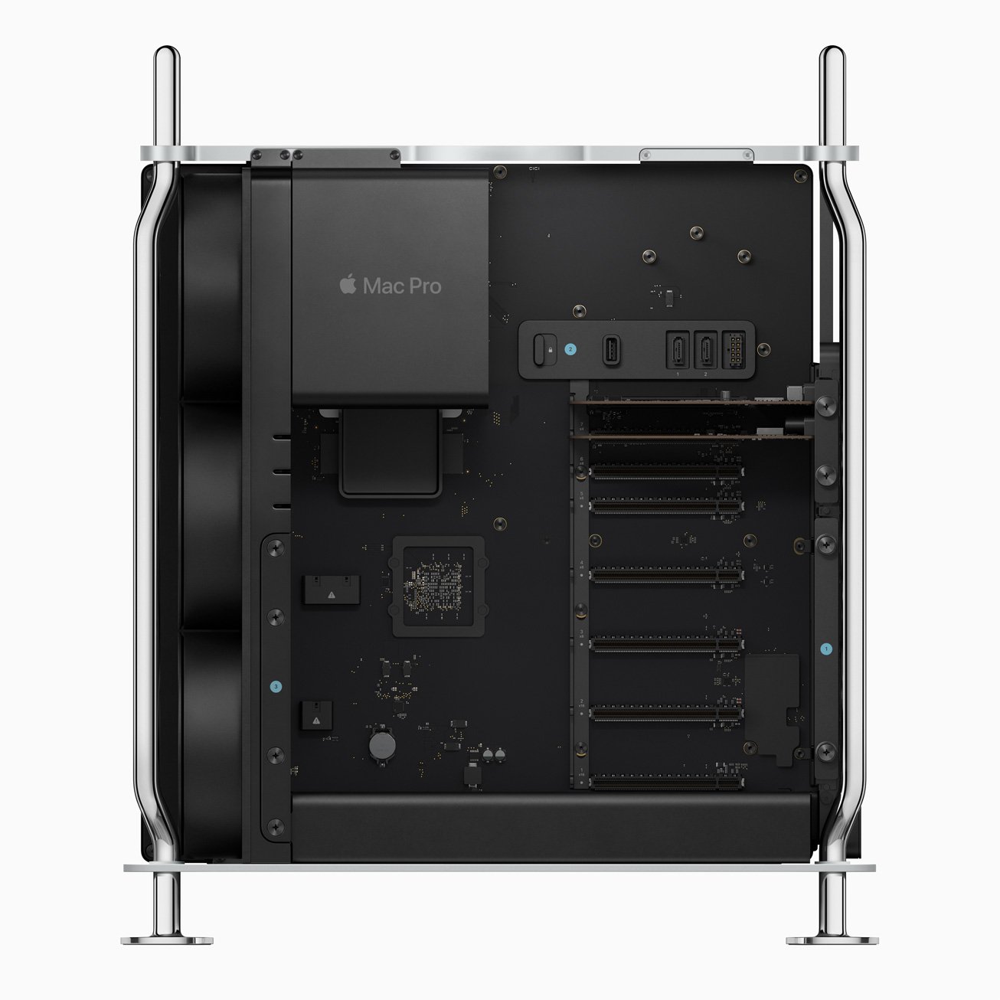
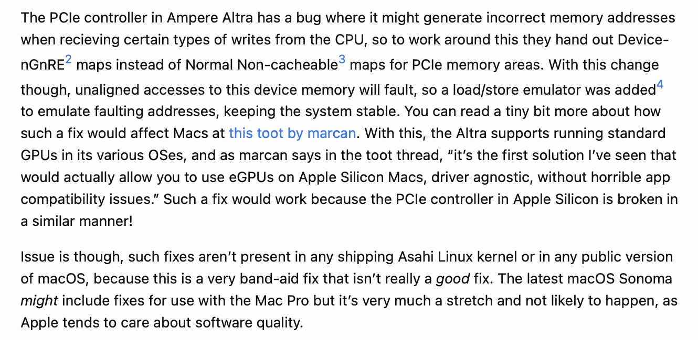

# WWDC23 - Mac hardware

At WWDC23, Apple introduced 4 new Macs! Let's dig in!

## MacBook Air 15-inch

Apple finally did it - they made the 15-inch MacBook Air! If I didn't have a 16-inch MacBook Pro (or if I didn't need the performance from a Pro/Max chip,) I would have definitely gotten a 15-inch Air - it's the perfect size, weight, and portability, and really just shows what crazy things Apple Silicon can do.

The easiest way to describe the 15-inch MacBook Air is to call it the "13.6-inch but big" - it comes in the same colors with the same ports and the same display technology and same speaker design and same blahhh. But there are some noteworthy changes granted to the Air because of its size:

- Apple was able to fit in two more speakers for "double the bass" - this is to be confirmed, however I'm guessing it's somewhere on the true side because of how good MacBook speakers have been since around 2016.

- Apple was able to grow the display to 15.3" diagonally, while still keeping the same thinness from top to bottom. I can't confirm whether or not it's the world's thinnest 15-inch laptop, but with Apple Silicon I can't rule that out as being true either.

- Battery life is advertised to be about the same as the 13.6-inch with the same specs, but it might hold up longer due to increase battery cell size.

- The wallpaper is gorgeous. Like seriously, that wallpaper is amazing.

- The 15-inch Air's introduction pushed the 13.6-inch Air's price down by $100 - it's now $1099 new from Apple!

There's really not much to say about the 15-inch MacBook Air, as we've already reviewed most of it through the 13-inch Air with M2. It's nice to have an option for a Mac that has a large screen without the Pro price tag attached.

## Mac Studio

Apple also announced updated Mac Studios with M2 Max and M2 Ultra - a nice refresh from last year's M1 Max and M1 Ultra.

- With M2 Max, the Mac Studio gets
    - 12-core CPU
    
    - 30- or 38-core GPU
    
    - Up to 96GB of unified memory

- with M2 Ultra, the Mac Studio reaches
    - 24-core CPU
    
    - 60- or 76-core GPU
    
    - Up to 192GB of unified memory

- And both configurations maintain up to 8 terabytes of internal storage

While performance claims are yet to be proven, M2 Max and M2 Ultra seem like a legit deal for professionals, although if you already have a Mac Studio with M1 Max or M1 Ultra, it might just be a generational upgrade rather than a big leap forward for the Mac.

## Mac Pro

Yes, Apple finally did it. They brought Apple Silicon to the new Mac Pro with M2 Ultra.

The simplest way to put the new Mac Pro: Mac Studio with PCIe expansion. That's just what it is, no matter how you try to put it - it's a Mac Studio's specifications shoved into a chassis that allows expansion.

The people I have seen complaining about the Mac Pro aren't coming from a professional-workflow standpoint, and as such that's a big factor in saying why the current complaints might not hold up in the real world. I will list the two main complaints and talk about them, though.

### Limited upgradability

This one is a big one for a lot of people - the fact that you can't upgrade the CPU, GPU, or RAM in the new Apple Silicon Mac Pro. The best way to fight off the fight two is simply because there are no real upgrade paths you can take for the new Mac Pro. Even if it wasn't soldered onto the board, what would you replace the M2 Ultra with? This is why an M2 Extreme may have been a good idea but for professional workflows, M2 Max and M2 Ultra are just right for what they do.

Although the last part, about that RAM. It's still okay here - even if the 2019 Mac Pro could reach a maximum limit of 1.5TB. Apple Silicon uses LPDDR5 chips for its unified memory architecture - a relatively new technology that costs heaps to produce in the way Apple produces it. Even professional users would not want to be paying the insane premiums required to get to the 1.5TB level of the previous generation. Logistically it's just not possible.

### No dedicated GPU support

That last reason is a great segue into the issue of the new Mac Pro not supporting dedicated graphics cards in its PCIe or Thunderbolt ports. This has been a limitation since the beginning of Apple Silicon on the Mac, and with the Mac Pro with PCIe slots? People are annoyed about this shortcoming.

However, investigation reveals that this isn't just because Apple want you to upgrade to a more expensive computer. Stella [reported this on her blog a few days ago,](https://blog.thatstel.la/update/ios/2023/06/05/my-thoughts-on-wwdc-2023.html) but the limitations on Apple Silicon seem to be done out of software quality rather than hardware-based limitations:

This makes sense, because Apple always seems to push for the tight integration of hardware and software to make their experiences great. Given that the solution is deemed unshippable by the company and an Asahi Linux developer too, it's safe to say that it's currently better to not be allowing dedicated cards to be connected. Otherwise you might lose all of your work.

Although, Stella did manage to find evidence of Apple working on this problem in macOS Sonoma - she was able to get a graphics card to enumerate in 14 by simply plugging it in. This is something that macOS Ventura and older didn't do - so it could be an indicator of what is to come in the future.
