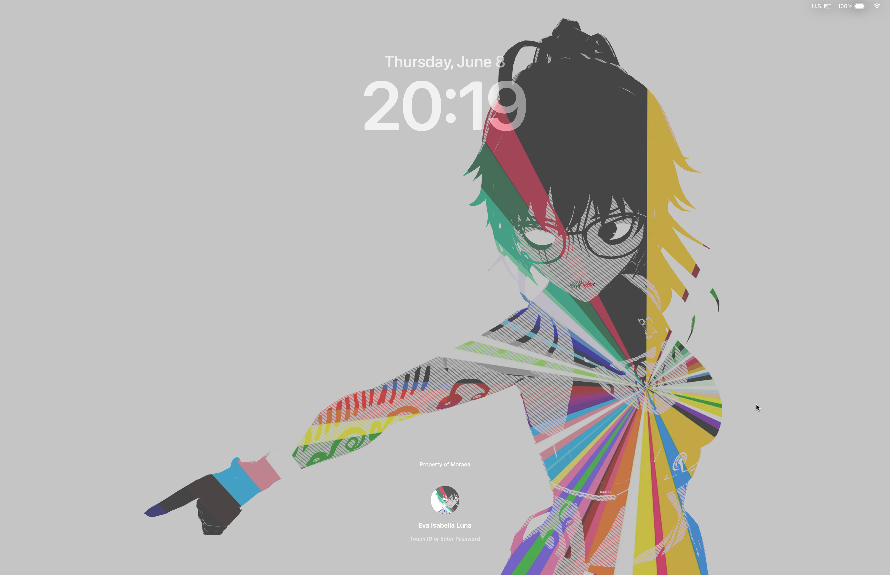
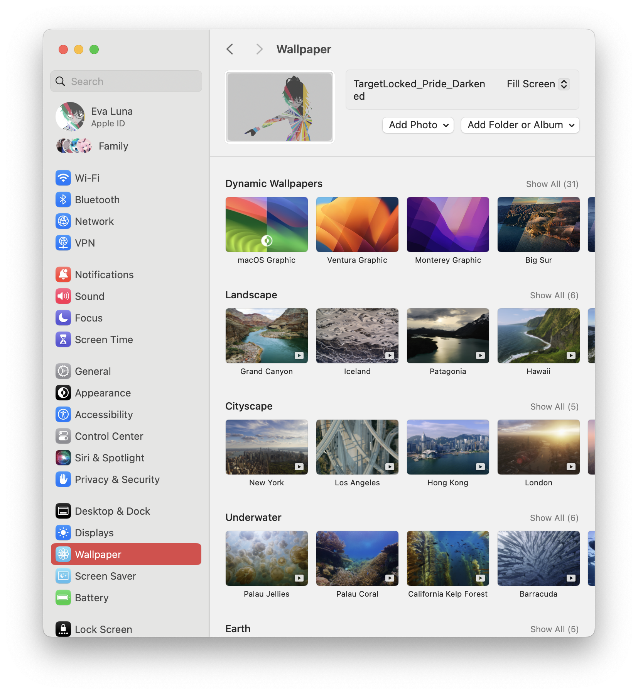
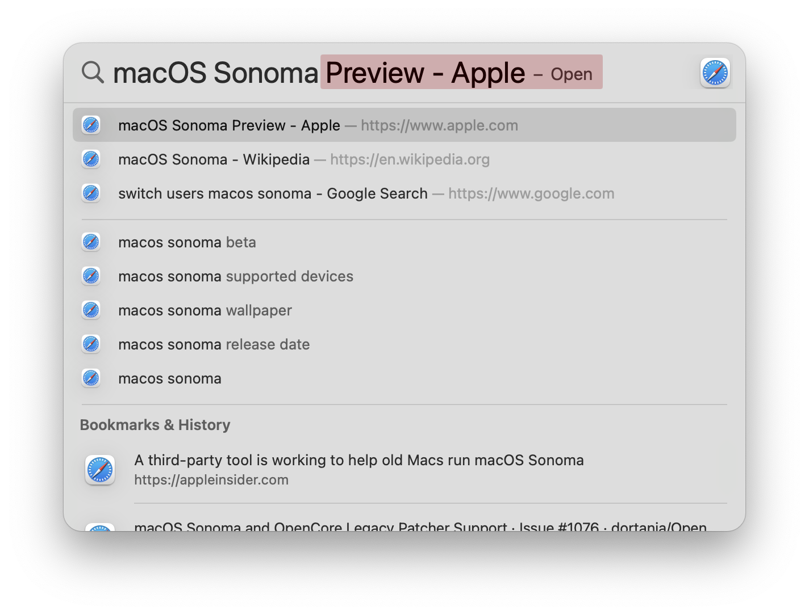
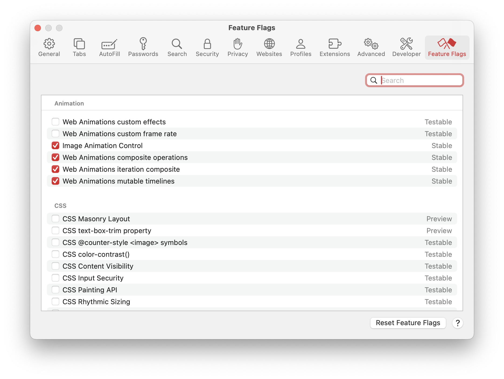
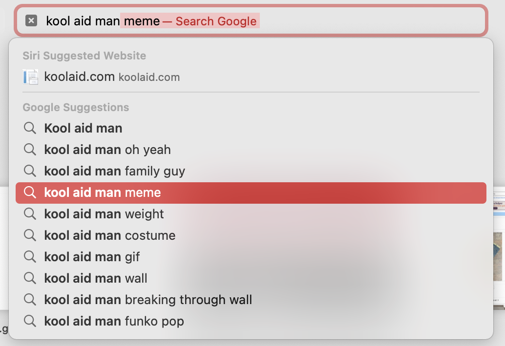
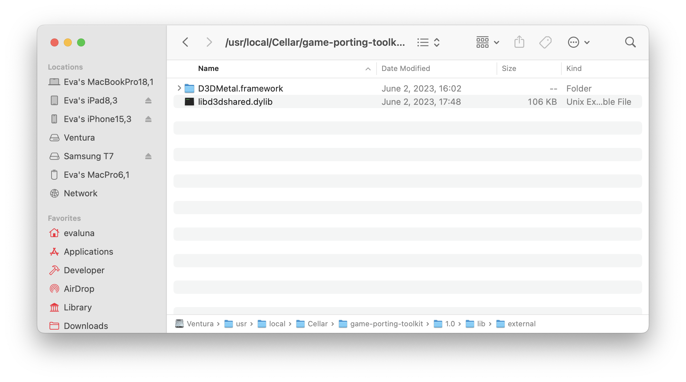
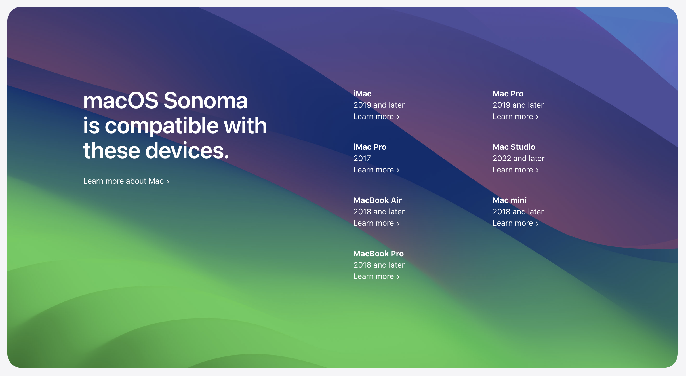

# WWDC23 - macOS Sonoma

Next up, we've got **macOS Sonoma**.

## Lock Screen

Apple made some big changes to the Lock Screen in macOS Sonoma:



As you can see, the clock is big like iOS and iPadOS (although you can't customize it.. yet at least), and the accounts to choose from have been moved to the bottom of the screen. It's a nce way to be able to look at your wallpapers - especially the brand new movie-like wallpapers/screensavers Apple added in this update as well:



There are some bugs and gripes with the lock screen though:

- The clock doesn't adapt its color to your wallpaper much, meaning that you'll want to darken lighter photos or else you won't be able to read the time or see your user name.

- The way to switch accounts i consists of hovering over the profile picture of the one currently shown and then selecting the account you want to use. This is... weird, but it's actually a somewhat laggy experience even on my Apple Silicon Mac when you have FileVault 2 enabled.

## Desktop and General UX

One of the main features in Sonoma is widgets - and it's amazing to have widgets on the Desktop now.


As you can see, I have a lot of widgets, and they fade to monochrome when I open a window. It's nice to be able to glance at information from time to time - and having a new macOS-native batteries widget is definitely a pro - but be aware of where you place them. Pressing them directly, even when not focused, will open the app they are assigned to or interact with them. It's annoying when you accidentally miss the Stage Manager windows (which have improved animations too) and open some random app you didn't mean to, but that's a me problem here.

I've also noticed changes to notifications - they slide in and slow as they reach their end destination, and some pop into view slowly, like the AirPods switching (which is WAY more reliable in iOS/iPadOS 17 and macOS Sonoma!)



Spotlight also got some changes here too - as well as the text caret adapting to your accent color in some apps. The changes are similar to iOS in this way, though.

## Safari

Safari gets the same features as iOS - the extra profiles and better protected Private browsing mode. We also see the addition of a new Feature Flags menu to control experimental features, now moved from the Develop tab in the menu bar:



It also gains bold text in the search bar when you're typing, a really nice touch to remember where you are in your thought.



## Gaming on Mac

I've been pretty short with the other sections because I'm really excited to share my favorite part of Sonoma: the Game Porting Toolkit that Apple introduced to help game developers test their existing Windows games on Apple Silicon Macs.



The Game Porting Toolkit consists of a custom Crossover 22.1.0-based copy of Wine 7.7, with a custom graphics stack that converts DirectX 9, 10, 11, and even 12 _directly_ to Metal 3. Even though this custom version of Wine runs in Rosetta, it seems that it does not work on Intel-based Macs. Not sure why, but it is probably Apple doing a funny to ensure that the Mac is capable of using the Metal 3 API and also trying to sell more Apple Silicon machines.

The setup process was relatively straighforward, beyond me having multiple skill issues with my x86 install of Homebrew, where I had to reinstall it three times because it kept going to the wrong directory for some reason. Once I had that figured out though, I managed to get the toolkit to start building - yes, building the entirety of Wine - on my 2021 16".

After that though, it was a simple process of launching apps. I did have issues using the supplied commands to run games though, so I just aliased a few commands to replicate their behaviour:

```
alias gptk='MTL_HUD_ENABLED=1 WINEESYNC=1 WINEPREFIX=~/.game-porting-kit-prefix `/usr/local/bin/brew --prefix game-porting-toolkit`/bin/wine64'
alias gptk-no-esync='MTL_HUD_ENABLED=1 WINEPREFIX=~/.game-porting-kit-prefix `/usr/local/bin/brew --prefix game-porting-toolkit`/bin/wine64'
alias gptk-no-hud='WINEESYNC=1 WINEPREFIX=~/.game-porting-kit-prefix `/usr/local/bin/brew --prefix game-porting-toolkit`/bin/wine64'
alias gptk-no-nothing='WINEPREFIX=~/.game-porting-kit-prefix `/usr/local/bin/brew --prefix game-porting-toolkit`/bin/wine64'
```

Obviously the above aliases need to be changed for your WINEPREFIX location, but these work 100% of the time.

From then on, I installed Steam (and had to continuously restart it in order to be able to sign in because the webview kept displaying black,) but afterwards I was able to download and install a game: Stray.

Now, back when Crossover 22.0 was the main version, Stray did not work properly, as it needed mesh shaders in order to work. Fast forward to now, Stray running in DX11 mode with D3DMetal.framework was _somewhat_ playable - 20FPS with major stuttering. As a test of the D3DMetal capabilities, I flipped to DX12 mode - and what I found was astonishing.


These are screenshots of Stray, running at 2056x1329, and the game runs (gernerally) at around 80 FPS on my M1 Pro with low settings. To think that this game went from not working at all, to running this well through Rosetta and Dx12->Metal translation, and a Mac native port is also on the way gets you thinking, doesn't it?

Ever since Apple announced the GPTK, I have seen nothing but people praising these moves by the fruity company to get gaming back on the Mac. Never have I ever seen performance like this even on an Intel-based Mac in its standard configuration - and now that Stella has found evidence that external GPUs enumerate on Sonoma (although her blog post explains why currently it is not viable to have eGPUs/dGPUs on Apple Silicon just yet) - who knows what will happen in the future.

M1 already showed that Apple Silicon capable of running some of the best titles on the market - Cyberpunk 2077, for example, runs Ultra graphics at 14FPS on an M1 MacBook Pro with 16GB of memory. That doesn't sounds great, but 14FPS on a laptop like that, SoC like that, it's insanely impressive. I've downloaded Cyberpunk 2077 to see how far I can push it on my M1 Pro and still have what people call "a usable experience".

It's nice to see Apple making some great changes to macOS, Metal, and their products to push forward gaming - for real this time. It's opened up multiple games to the platform - No Man's Sky, Stray, Death Stranding, Resident Evil, and more are coming faster than ever because of the capabilities of these new machines and easy-to-use APIs.

And I'm sure that the common "Gaming on a Mac is a joke" trope will be falling away just as fast.

## Other stuff

Again, like my iOS post, I haven't really gotten into anything else because I've mainly been messing around with the Game Porting Toolkit and also have other things to do. I will again make note of the compatibility list that Sonoma brings with it:



And, oh my goodness. It feels so good to know that I was right about my macOS 14 support theory a [few weeks ago](https://crystall1ne.dev/2023/02/12/macos-support-theory/). I'm not really sad about any of the devices that were dropped, other than the 2017 12" MacBook being removed and all of the MacBook line being dead now. It also means that Sonoma created more problems for legacy macs and Hackintoshes - as of writing, all Broadcom wifi that's able to be socketed no longer works, and 3802 Legacy Metal GPUs aren't even able to boot the operating system.

Tough times, but we'll overcome them. We always do.
