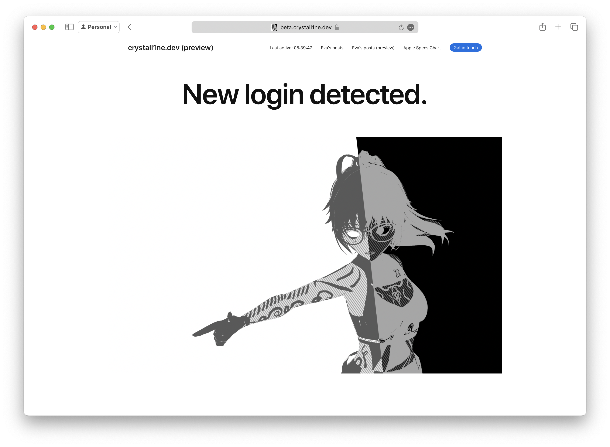

# Rebranding crystall1ne.dev

It's currently early in the morning for me, and I was working on a few internal DNS related things for my apartment with Stella. With those done, I can talk about that banner at the top of all my website pages.

That's right - with her help, I'm taking this website a whole new direction with more focus on my work, my lore, and my content. I'm using a layout pretty much made by apple.com, with many tweaks to offer a comfortable experience for what I wanted out of it.

This process of creating a new website is not a simply task done in a few days. We've been working on this for a few weeks now, and still have much work left to be done. Alongside this one, I need to architect two new websites...

...and then move it all to a different place on my server.

The website wouldn't be getting so far without Stella's continued help and support in creating it, though...

(man she's such a good wife)
