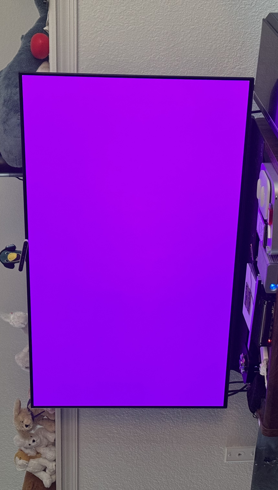

# Introducing the Developer Transition Kit

In my [last post](../04/where-have-i-been.md#dtk-who), I talked about how dosdude1 shipped out one of the few Apple silicon DTKs that he was able to repair to Stella and I. This blog post is mainly talking about the hardware itself, some of its quirks, what we've been doing with it, and where we are taking it in the future!

## `ADP3,2`

The DTK's story starts with the SoC: `T8027`. The public-facing name for it is **Apple A12Z Bionic**, which is just a renamed A12X that has all of its GPU cores enabled. Other than some board strapping and configuration differences, as well as the **16GB of LPDDR4X** over the 6GB found in the iPads, it's the **same SoC with all of the same features** - ANE, AVE and AVD, Vortex/Tempest, M12, so on and so forth.

With this SoC, as well as other changes to its board in order for it to work "enough", Apple created a **modified 2018 Mac mini** motherboard that was (almost) completely **compatible with the casing from it**. This familiar, yet completely new experience provided developers in the **Universal App Quick Start Program** the tool they needed to build and run their Universal2 apps (and test their existing ones in Rosetta) before M1 officially launched.

::: warning That being said...

Stella and I don't have anything other than the **DTK board itself**, connected to power using a [USB-C PD board we soldered directly](https://twitter.com/thatstella7922/status/1799686950019833933) to some of the pins on the PSU connector. 

:::

With the new board came new identifiers: **production unit DTKs have a boardconfig of `J273aAP` and a model identifier of `ADP3,2`**. This configuration is supported (at least, officially) with **`20A5299w` until `20E5186d`** - as builds **`20E5196f` and later do not have the firmware for the DTK**, and later builds began the process of **removing the kernel and some supporting extensions**.

At least now, **`20D91` is the newest version still signed for the DTK** (Apple unsigns macOS betas after a certain period of time, so the compatible `20Exxxx` builds can't be installed via DFU/Recovery Mode.) For simplicity, we've chosen to stick with this - but I am still doing research to find out if it can be taken farther.

## A (buggy) Apple silicon Mac

As a pre-production unit that was never supposed to be used after the leasing period was up, the **DTK has many behaviors that stand it out against other Macs with Apple silicon**. Some notable inclusions pulled from the [DTK Release Notes PDF](https://crystall1ne.dev/cdn/DTK_Release_notes.pdf) (that I have noticed in its usage) include:

### Hardware 

::: details T8027 doesn't support 4K memory pagesize

This one made quite a splash with apps like Chrome and Firefox needing to be modified in order to support the 16K pagesize that the A12Z supports. Apps that still use 4K memory pages, such as WINE, continue to not work.

:::

::: details T8027 doesn't support Hypervisor.framework

Apple silicon SoCs before `T8101` and `T8103` (A14 Bionic and M1 respectively) do not have hardware virtualization capabilities at all. Emulators like QEMU continue to work, however, due to their ability to emulate rather than virtualize.

:::

::: details T8027 has a power-hungry SMC

Due to how the SMC is usually powered by a battery that is much larger than a simple BR1632A, Apple opted to put *three* of them onto the DTK's board - and they would still only last around 6 months. However, the DTK works just fine without them (other than losing its clock when power is lost, and automatically starting itself when power is reconnected.)

:::

::: details ADP3,2 doesn't support force shut down via the power button

This seems to only apply to the power button on the *case* of the DTK - the pads for `PWR_ON_OFF` directly on the board can be bridged directly to initiate a forced shutdown.

Speaking of the power button, did you notice the red light coming from the left side of our DTK? dosdude1 managed to swap on **production DTK parts** into a **development DTK board** - so we have the fancy `PMU_RESET`, `PWR_ON_OFF`, and `FORCE_DFU` buttons and LEDs. Super helpful for debugging (although the pads are free even on production boards!)

:::

::: details ADP3,2 is the only 2020 Mac to not support Thunderbolt

Snazzy Q actually covered this in his video, noting the [lack of Thunderbolt retimers on the board.](https://youtu.be/e6XmkJlepBs?feature=shared&t=742) This leaves the DTK to only have USB-C at 10Gbps speeds, with support for DisplayPort Alt Mode.

:::

### Software

::: details ADP3,2 takes a bit to initialize its framebuffer

Upon boot, the DTK tends to flash a black screen once or twice, and then show the end of the Apple logo progress bar as it boots into macOS (or directly shows the Startup Manager screen if you are choosing to boot into SFR.) Occassionally, the DTK will output a magenta screen like a [panicking device with A12 or later:](https://www.reddit.com/r/iPadPro/comments/p7wbm3/is_anyone_else_facing_a_random_pink_screen_flash/)

:::

::: details ADP3,2 doesn't support installing macOS to another volume

In the PDF, Apple says this:

At least in my usage of the DTK, you can still use an InstallAssistant package to install macOS to another volume. I haven't tried macOS Recovery though.

:::

::: details ADP3,2 doesn't support HDCP or FairPlay-protected content

Apple Music, Apple TV, Safari, and other protected content apps don't work properly on the DTK. However, FairPlay seems to work enough to at least grant iOS apps running.

:::

::: details Rosetta 2 uses only the Vortex cores

This is partly why the [first DTK Geekbench 5 scores](https://www.notebookcheck.net/First-A12Z-Bionic-DTK-Geekbench-5-benchmarks-show-Apple-s-transition-holds-immense-promise-only-a-28-in-drop-seen-in-single-core-score-compared-to-the-MacBook-Air-2020.477595.0.html) show about a 52% performance loss compared to a 2020 iPad Pro with the same SoC. 

:::

Aside from the above issues (and many others I haven't talked about from the PDF), there are new issues that come from using `T8027` in an age where `T8103` is the oldest officially supported device capable of running macOS: ARM ISA differences. There are many projects that will crash on the DTK because they were compiled with instructions that `T8027` doesn't support. Needless to say, I'm keeping a macOS Big Sur VM around on my server to deal with these issues, which included cross-compiling `rust`.

## The current status of our DTK

Before I brushed off the DTK after our move, I was using a 2014 Mac mini to do the server tasks I needed out of macOS - not to mention, it was a birthday gift from a kind soul in OCLP. As a bit of a test to see how well the DTK would do in its place, I spent a few weeks moving the 2014's tasks into the DTK. I have been *almost* completely successful with that job:

The only things that truly remain are my GitHub Actions setup, and possibly recompiling CPython. Other than that, it performs well, efficiently, and even without a fan!

## The future status of our DTK

The DTK is an interesting specimen, and it's also the first Mac with Apple silicon to be dropped from support. With aging hardware on an aging instruction set, with aging software that is starting to lose app support (and WebKit has already broken,) we have been exploring the possiblity of running newer macOS releases on the DTK. Currently, I have been able to gather the following:

- Build `20E5186d` has the kernel, kexts, and firmware for `T8027` and `J273aAP`
  - Build `20E5172i` firmware has a bug that [breaks both USB-A ports](<https://twitter.com/classicii_mrmac/status/1358147658276352001>)
  - Build `20E5186d` firmware possibly has a bug that [breaks USB-C display output](<https://forums.developer.apple.com/forums/thread/673922>)
  - Build `20E5196f` and later release notes say that [DTK support is unavailable](https://developer.apple.com/documentation/macos-release-notes/macos-big-sur-11_3-release-notes#Deprecations)
- Build `20E5196f` has the kernel and kexts intact for `T8027`, but none of the firmware for `J273aAP`
- Build `21A5284e` has the kexts for `T8027`, but no kernel for `T8027` or any of the firmware for `J273aAP`
  - Build `21A5268h` might not have the kernel as well
- Build `22A5266r` does not have some required kexts, kernel, or any of the firmware
  - An assumption as was probably removed earlier (I just haven't confirmed when)

The possibility of running a newer version of macOS is still up in the air, and needs more digging to be confirmed one way or another (however, based on past trends, it seems unlikely at the moment.)

Recently, iOS jailbreak developer and fellow reverse engineer [Nick Chan](https://procursus.social/@riscv64) has been working on porting Linux to checkm8 devices. He's been doing a really great job, and has also asked for our help in testing his patches on our DTK. You can see his work here:

- [https://github.com/asdfugil/linux-apple](https://github.com/asdfugil/linux-apple)
- [https://github.com/asdfugil/m1n1-idevice](https://github.com/asdfugil/m1n1-idevice)

We're excited to help and see how this ends up.

There's of course the last remaining pieces to put together in order for the 2014 Mac mini's transition to be complete - and I'll be tackling those for a while. In the meantime and after those are fixed, the DTK will be serving some of its life as a (somewhat) stable-enough server to host those macOS things that I needed.

Oh, and we'll also make sure to get the right parts to give it a proper case, PSU, IO plate, etc.

## Final thoughts

Having a DTK in 2024 is a very interesting experience, and it's been a real test of my macOS hacking knowledge - but I have learned *quite* a bit from it, and plan to continue doing so. I also compiled my own JDK for it (to solve some Minecraft server crashes), and will probably be adding a new server to `mc.thatstel.la` later on for fun ;)

Happy hacking,  
\- Eva