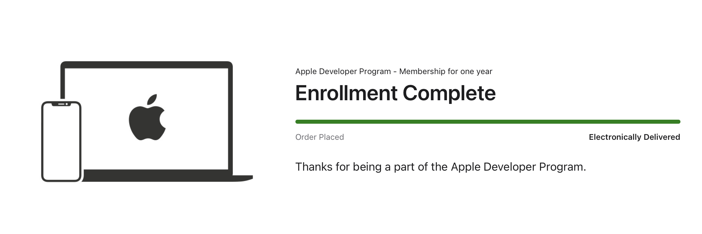

# Hello, Apple Developer

So, I'm in a bit of a pickle right now. If you couldn't already tell, it has to do entirely with the title of this post.

The above is an acknowledgement of my yearly renewal for my paid agreement with Apple for their Developer Program. This one happens to be from January of this year, and that means the time is coming very quickly for me to renew it again.

## A little backstory

For the uninitiated (or just the Android users,) Apple has tiers for their developer program. There's a free one that is heavily limited in its functionality, and a paid one that you can spend $99 a year to get access to. At least for me, it provides the following benefits:

- Increased signing time from 7 days to 365 days
- Ability to add a much larger amount of devices
- Access to developer betas
    - At the time I first signed up, they weren't open to all
- Ability to request and sign with many more entitlements
- Ability to use Xcode Cloud for Ci/CD
- Ability to distribute with TestFlight and the App Store
- Ability to notarize apps on macOS outside of the App Store

There are plenty of other benefits, but these are the ones that are most relevant to me, and the others are out of scope for this post.

## The problem

This year is a little tough on whether or not I will be renewing the developer account. While one of the factors involved is indeed money, there are others that are making me think twice this time around.

### In the middle

I love and support Stella. Absolutely, I do. However... I'm caught in the middle over her relationship with Apple. I want to support her mission to vote with her money, and show her that I agree with her values on Apple's recent anti-consumer antics.

On the other hand, we both believe that there are aspects of Apple that *should* be embraced - with a monthly contribution from my father, we pay for Apple One since we find real value in the services offered. Apple Music provides an easy way to high-quality tracks for the entire Apple family we've built, while being convenient to use. Apple TV+ has some banger shows and movies, Apple Arcade gives some classic games we grew up with, iCloud+ handles our cloud storage needs and my emails, so on and so forth.

But, there is a conflict of interest here. I believe that my Apple Developer Program payment is worth it while the reason it exists is the entire reason Stella moved to Android and Windows. She talks about how she doesn't need to deal with the mandatory codesigning or notarization policies, and is free to run the software she wants with the permissions and entitlements that she wants on her OnePlus 12. If not, she can root and be done with it, like she did with the OnePlus Pad 2.

I am a firm believer in paying for something that I find true value in. So while I support Stella's initiative, and have my own issues with Apple... I want to continue to renew the account. But it's hard to say that without feeling selfish about it, because I also believe in what Stella speaks out against.

### An issue of money

Another major factor in the uncertainty I'm facing is due to the yearly fee that is imposed by having the account. Due to the fact that the account only exists for the reasons Stella went to Android and Windows, we had a discussion. She told me that she didn't mind if I still subscribed to the program, since I use it. The condition was that I would need to pay for it on my own, which is completely understandable.

One of the reasons I signed up for the Apple Developer Program is because I had planned everything out - I was going to use the income from my Patreon to save up a bit of money each month in order to renew it every year. Nowadays, pretty much all of my Patreon earnings go towards bills, so that isn't much of an option.

TL;DR? I don't currently have a method of paying for it.

## What now?

This post isn't for much reason other than me trying to feel better about the situation, since writing about things does that for me.

The deadline for renewal is going to be here in less than a month, and this is honestly something I don't want to be dealing with around Christmas time. I created the problem, though, so it's only fair that I solve it.

There is no doubt in my mind that I want to renew the account. I find value in having it, and it's very helpful for the things I do in my daily life, even if I don't agree with Apple's behavior. However, I need to be prepared for the worst case scenario, so... in the event that I shut it down, a few things will change.

- For the few that I shared device slots, certificates, and provisioning profiles with: Once those certificates expire (and if my account is still inactive), you won't be getting new ones.
- For those with Stella's apps in your purchased history: those apps will be removed from your purchase history since the account won't be able to use App Store Connect. You can still use the methods described in [Stella's blog post](https://blog.thatstel.la/software/2024/07/18/update-on-the-availability-of-battery-webhook.html) about the removals to install those apps, however.
- For my Malachite testers, it likely means the end of my development on the app. I would explain here, but the developer account is only one reason alongside others... so that will be for the next blog post.

Nothing is said and done yet, though, so we'll just have to wait and see how things play out.

::: warning Update before posting

I was originally planning to release this alongside the Malachite blog post, but it's currently 05:13 in the morning and my insomnia is wearing off... plus my IDE decided to erase what I already had written for that one. I'll finish it up when I'm not tired.

:::

Very stressed and broke,  
\- Eva