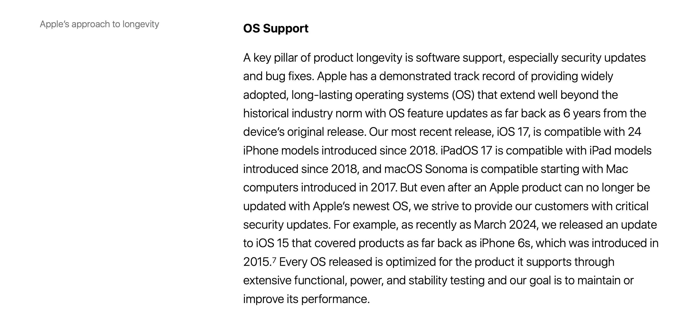

# Longevity, by Chance

A few weeks after WWDC24 concluded in June, Apple published a whitepaper titled [Longevity by Design.](https://support.apple.com/content/dam/edam/applecare/images/en_US/otherassets/programs/Longevity_by_Design.pdf) The document attempts to reach out to consumers and describe some of the ways Apple designs their products to last, while providing repairability that prioritizes security, and lay out the facts in terms of how Apple supports their products in the long run.

When the paper first dropped, Stella and I took a good look at it and started to pick it apart. I've been meaning to get this blog post out for a while, and I suddenly got the urge to do it when I was holding my iPad Pro earlier.

## OS support - page 6

> But even after an Apple product **can no longer be updated** with Apple’s newest OS...

Day 1 of WWDC24 had just ended, and I'm refreshing Apple's webste to see the supported devices list. I eagerly hold onto my 2017 12.9-inch iPad Pro, expecting to see it fall alongside all other non-arm64e (pre-A12) iPads, and be stuck on iPadOS 17.

The final refresh and scroll down reveals... wait, what? iPadOS 18 supports iPad (7th generation) and later? But the iPad 7 has a lowly A10, while the 2017 iPad Pros have A10X - and that's not even the limit of its superiority!

Apple constantly touts how "no one can be as tightly integrated as Apple" in terms of firmware, software, hardware, drivers, etc., but this PDF is suddenly pushing a narrative that they "can no longer" push software updates to older devices?

The A10X Fusion is a prime example of how it is not a "can no longer" situation - **it is a matter of whether or not Apple *wants* to support it any longer**. The A10X iPad Pros are over seven years old now, and they've been replaced many times by subsequent iPad Pro models. It is certainly impressive to see it having gotten iOS 10 to iPadOS 17, but **it is downright disrespectful** to say that you are unable to continue updating the device to your customers, especially when a lot of the hardware is shared with devices that are still supported by the newest OS releases (even the chip!)

### Against their own words

In the FAQ section of the document, Apple poses this question:
> Does Apple engage in ‘planned obsolescence,’ the practice of intentionally designing devices that rapidly become obsolete, to drive sales of new products?

The first two words in the reply are "Absolutely not."

It is hard to read this with a straight face. It may not be a rapid process, since seven years *is* a long time, but it is disingenous when you have sent perfectly fine devices into their inevitable ends just weeks before.

Apple's process of obsoleting devices doesn't just come from lack of yearly OS upgrades. App support will begin to dwindle as time goes on and Xcode (inevitably) stops supporting iPadOS 17, and the "critical security updates" that Apple guaranteed in this PDF is not a completely accurate representation of the real world, either. **Once the device is dropped, it is designed to be left behind,** and there is no alternative option. Nick Chan's Linux work is honestly just tech demo in the present, and turning that into Android is not going to be for a while.

This also doesn't cover when A12 and later devices get dropped from support. Those devices *will* be obsolete without OS upgrades and app support (and without either a bootrom exploit or help from Apple to unlock iBoot), which *will* result in them being discarded and replaced.

This is why I titled this post (and the next few, where I continue to talk about the implications of this document) "Longevity, by Chance." It's not a given that your device will get updates, even if you paid thousands of dollars for the [privilege of leasing it.](http://blog.crystall1ne.dev/posts/2024/12/18/deactivating-after-life.html#a-license-not-a-purchase)

Embracing my A10X iPad Pro,  
\- Eva