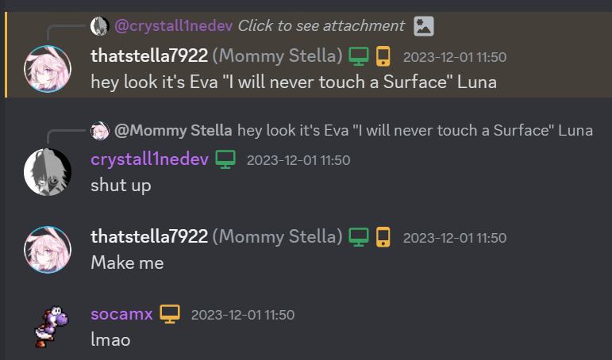

# BirchWay

To the keen eyed out there, the title of this post is the codename to the Intel variant of the Surface Pro 9. It's also the codename of my current daily driver computer.

## Wait... what?

Yep. My current daily driver laptop (and computer, as a whole) is no longer the MacBook Pro (16-inch, 2021) with M1 Max, 32GB RAM, and 2TB of storage that Stella gave to me a few months ago. It's not hard to see why, as my last few blog posts have been related to how I'm upset with the things Apple has been doing to their products, paying developers, and their users. 

There was once a point where I was willing to overlook the problems simply by enjoying the experience I got from the devices. Back when macOS Ventura and iOS 16 were the newest, I was more than willing to do that - the products were great, the operating systems felt decent to use and I had no plans or inklings of ideas to switching platforms.

Personally, things changed when macOS Sonoma and iOS 17 launched. Surprisingly, the beta cycle was mostly alright for me on my 14 Pro Max and my 2021 16-inch. When the two operating systems launched, it felt completely different. There were many very annoying issues that we weren't expecting to see from Apple, of all companies. Apple is usually known for their polish, the "tight hardware and software integration that only Apple can do." But... letting go of the trackpad wouldn't drop a dragged item, needing a restart of WindowServer to fix. Our HomeKit setup with only a few devices caused internet dropouts in some apps from the `utun` creation and destruction. Both of our MacBook Pros experienced DCP-related kernel panics (which prompted me to begin keeping panic logs and sorting them by the culprits on our server.) 

There were many issues that we encountered with macOS Sonoma and iOS 17 that we both didn't appreciate out of such expensive products - issues that didn't exist before. Issues that would have prevented Stella from buying the M1 Max in the first place, or prevented me from upgading my 14 Pro Max to a 15 Pro Max.

## A breaking point

The main thing that got me to switch wasn't actually any of that at all - it was me redefining what I needed out of a computer. I have the Xbox One X for gaming, and an upgradable server that I can chuck whatever parts I want into. This helped me realize that *wanting* the M1 Max didn't mean I *needed* it.

So, instead of continuing to use it, I decided that I was going to move out and we would sell it. We're also going to sell the M1 Pro later on - once we figure out what we'll replace it with as the Mac server computer (I have a few things that require macOS that need to be running.)

The options for a replacement device? Well... the first contender was Stella's **GalaxyBook Go**. It has a Snapdragon 8cx Gen 2 inside, with 8GB RAM and 128GB of storage. It's a decent little machine, but the limited amount of RAM, display quality, and poor performance kept me from daily driving it. There's the **2016 12-inch MacBook** I bought off of someone in OCLP, but it's obvious why I didn't start using that one (even though I really wanted to.) The **2016 15-inch MacBook Pro** I bought for OCLP testing didn't have a display, the **2012 13-inch MacBook Pro** was about as slow as the 12-inch, the **2015 11-inch MacBook Air** is still a brick and only has 4GB RAM anyway...

## The final option

Before Stella came to get me in 2023, I sent a message in my server that I would never touch a Surface. I think I deleted it a while back, but the joke is still very present in our circles, so here's a message from Stella months later about it:

A few days after she came to get me, I handled her Surface Pro 9. It's equipped with an Intel Core i5-1235U - 2 performance cores and 8 efficiency cores to make 12 threads usable in the operating system, paired with Intel Iris Xe Graphics with 5 execution units for "better than UHD" performance. It has a 2880x1920 screen with dynamic refresh rate up to 120Hz and as low as 30, with pixel response times on par or better than the 2021 16-inch. Two Thunderbolt 4 ports that double as standard USB4, with a Surflink (Surface Connect, officially) port on the other side. Two cameras, one for the back and one for the front with Windows Hello Face Recognition. A kickstand and the removable type cover, two identifying pieces that make it a Surface.

I originally passed it off as a candidate since I didn't like the touchpad on the type cover, it couldn't be Hackintoshed, and having it in my lap with my legs up was awkward. Over the past few weeks, I've gotten over these grievences, and gotten used to how a Surface Pro feels and handles itself - and this mchine is surprisingly capable for what I want it to do.

## Lying to myself

Even though I've settled into the Surface, and I've been settled for a few weeks now, I still held some hope that I would get another Mac. Maybe not an M6 Max MacBook Pro - but if Apple could fix the major user experience problems, I would settle for another one. I would look past my issues with their anti-consumerism, with their planned obsolescence, and the subpar experiences for quite the prices.

As each day passed, I slowly came to realize that holding out hope while I had pretty much completed the move to a Surface and still felt at home on Windows, and prefer some of the features to macOS now (window snapping with a touch screen, Windows Hello Face Recognition, competent SMB connections), I ended up confronting that idea and ending it.

## Rest in peace

My days of using a Mac as a daily driver laptop... are done. My next laptop will likely end up being an ARM Surface Pro with OLED, excited to see how Qualcomm takes X Elite to the next level with its Gen 2. I don't need anything crazy anymore, but would like a good OLED display running at 120Hz, with ports I will use and features that I enjoy. What I once shunned is now *exactly* what I wanted out of a computer (and I have pretty much branded this Surface Pro 9 as mine, with Stella's agreement.)

Still hate CRLF,   
\- Eva
